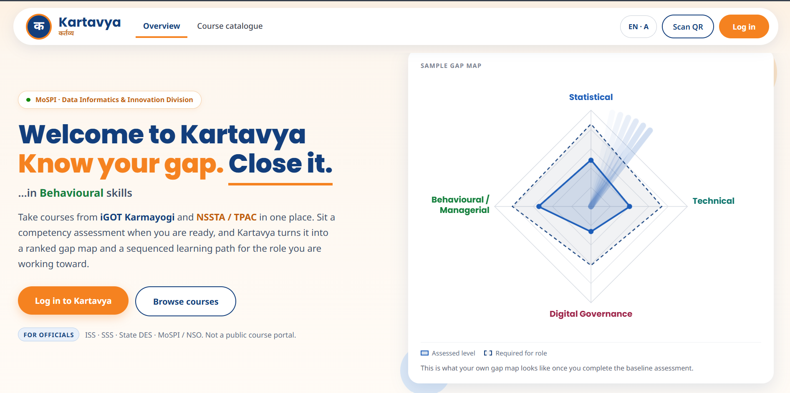
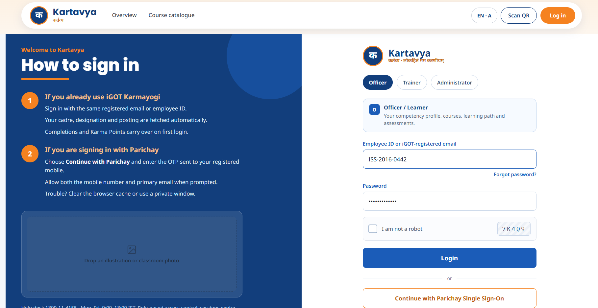
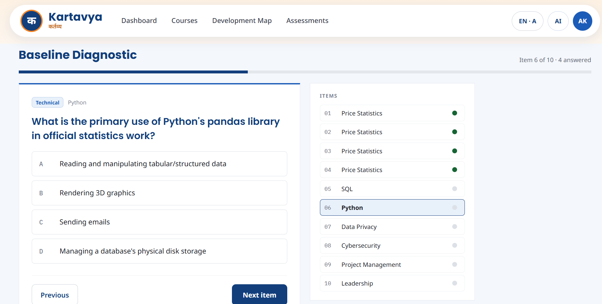
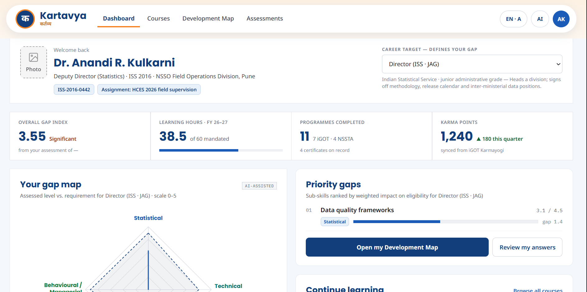
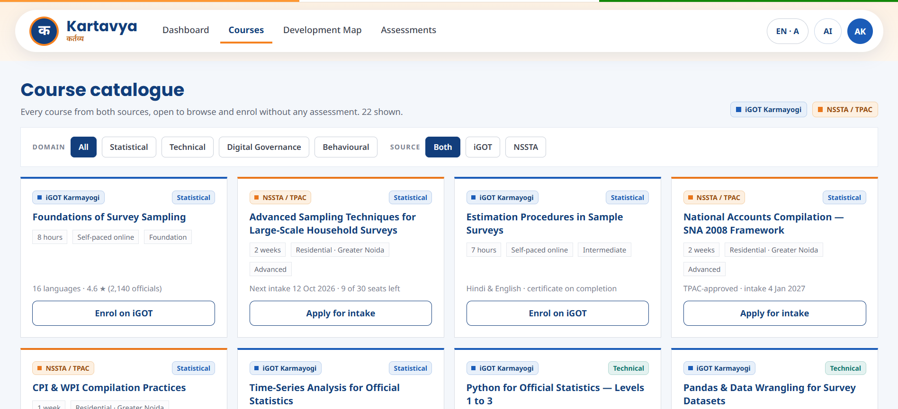
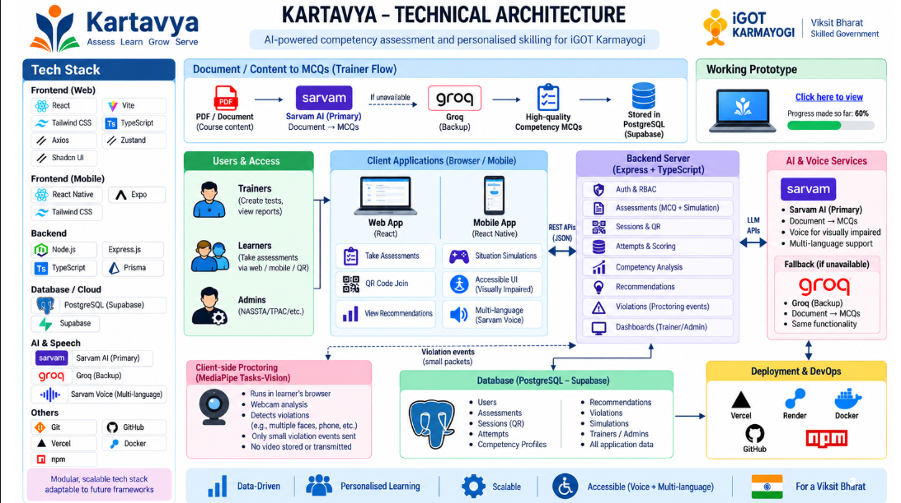
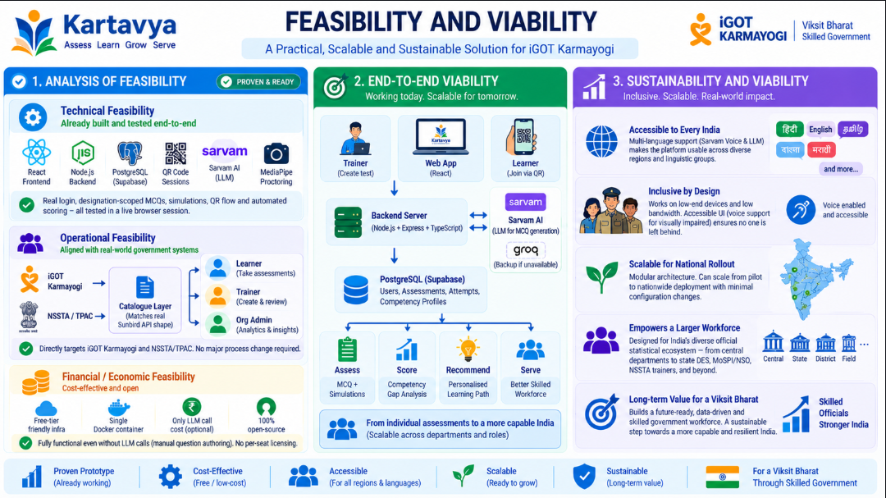
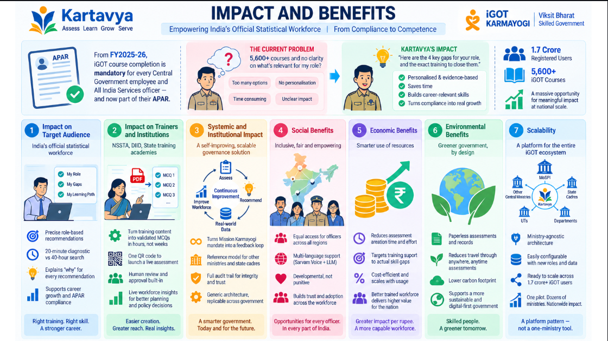

<div align="center">

# क​र्तव्य · Kartavya

### AI‑Enabled Skill Intelligence & Learning Platform for India's Official Statistical System

*"लोकहितं मम करणीयम्" — My duty is public welfare.*

[](https://problemstatement.md)
[](./problemstatement.md)
[](#)
[](#)


**Team PowerPuffBoys**

</div>

<br/>

<p align="center">
  
</p>

<p align="center">
  <em>The landing page. One line explains the entire product: officers connect their existing iGOT Karmayogi<br/>identity, sit a real competency assessment, and get back a live, explainable gap map instead of a<br/>5,600‑course catalogue with no sense of direction.</em>
</p>

<br/>

---

## Table of contents

1. [The problem, in one paragraph](#1-the-problem-in-one-paragraph)
2. [Our solution, in one paragraph](#2-our-solution-in-one-paragraph)
3. [See it in action](#3-see-it-in-action)
4. [Why Kartavya — our USPs](#4-why-kartavya--our-usps)
5. [Problem statement compliance matrix](#5-problem-statement-compliance-matrix)
6. [Feature walkthrough](#6-feature-walkthrough)
7. [The competency ontology](#7-the-competency-ontology)
8. [Technical architecture](#8-technical-architecture)
9. [Tech stack](#9-tech-stack)
10. [Data model](#10-data-model)
11. [Key algorithms — explained honestly](#11-key-algorithms--explained-honestly)
12. [The two-part onboarding assessment](#12-the-two-part-onboarding-assessment)
13. [Security, proctoring & integrity](#13-security-proctoring--integrity)
14. [Feasibility & viability](#14-feasibility--viability)
15. [Impact & benefits](#15-impact--benefits)
16. [What's real vs. what's a modeled stand-in](#16-whats-real-vs-what-is-a-modeled-stand-in)
17. [Project structure](#17-project-structure)
18. [Getting started](#18-getting-started)
19. [API surface](#19-api-surface)
20. [Roadmap](#20-roadmap)
21. [Team & credits](#21-team--credits)

---

## 1. The problem, in one paragraph

India's Official Statistical System (ISS/SSS officers, State DES staff, MoSPI/NSO personnel) must continuously upskill in statistical methodology, modern data-science tooling, digital governance, and managerial competencies — but the existing training ecosystem, **iGOT Karmayogi**, is a huge undifferentiated course catalogue of 5,600+ courses with no mechanism to tell an individual officer *which* of those courses actually closes *their* specific skill gap for *their* specific job role. There is no automated competency assessment, no gap-scoring, no personalized pathway, and building assessment content (quizzes/MCQs) from training material is still a fully manual, non-scalable process for trainers at institutions like NSSTA.

## 2. Our solution, in one paragraph

**Kartavya** is a full-stack web platform that builds a live competency profile for every officer, scores their gap against the specific requirements of the role they're aiming for (across 4 competency domains and 28 sub-skills), and turns that gap into an explainable, ranked list of real training recommendations pulled from both iGOT Karmayogi and NSSTA/TPAC. Every officer's baseline is established through a two-part onboarding assessment — a **designation-scoped general MCQ test** assembled live from an admin-reviewed question bank, and a **branching situation-simulation** that grades judgement on realistic on-the-job scenarios, not just recall. Trainers can turn any uploaded training document (PDF/DOCX/PPTX/OCR'd scans) into a reviewed MCQ bank using an LLM pipeline with a built-in answer-key-derivation and duplicate/negated-stem quality gate, then hand out that test to a room of officers via a single generated **QR code** that opens straight into a live, camera-proctored (MediaPipe: phone/face detection, tab-switch and fullscreen-exit tracking) exam session. Every submitted attempt — MCQ or simulation — feeds back into the same competency-scoring pipeline, so the officer's gap map, recommendations, and organization-wide analytics dashboards are always current.

---

## 3. See it in action

A walkthrough of the actual, running product — not mockups.

<br/>

<p align="center"></p>

### Sign in — Officer, Trainer, or Administrator

One portal, three roles. Officers sign in with their iGOT Karmayogi identity or a Parichay single-sign-on handoff, and their cadre, designation, and posting are resolved automatically — no separate registration form to fill out twice. The same screen serves NSSTA trainers and DIID/HR administrators, each landing on a role-specific workspace the instant they log in.

<br/>

<p align="center"></p>

### The baseline diagnostic

Ten items, drawn live from the question bank and scoped to the officer's actual sub-skills — here, a Deputy Director (Price Statistics) is being tested on Python, SQL, and Price Statistics, the exact sub-skills their target role requires. The item rail on the right tracks progress in real time; every question is graded the instant the officer submits, with a stored per-option explanation revealed afterward. This is one half of the two-part onboarding assessment — the other half is a branching situation-simulation (see [§12](#12-the-two-part-onboarding-assessment)).

<br/>

<p align="center"></p>

### The dashboard — your gap, visualised

The moment an assessment is submitted, this radar chart stops being a sales pitch and becomes real: the solid line is the officer's assessed level, the dashed line is what their chosen target role requires, computed live from `RoleCompetencyRequirement`. Below it, a **Priority gaps** panel ranks every sub-skill by weighted impact on eligibility for that role — "Data quality frameworks, gap 1.4" isn't a canned sentence, it's the actual output of the gap-scoring engine for this officer, this target role, this attempt.

<br/>

<p align="center"></p>

### Course catalogue — two sources, one interface

Every iGOT Karmayogi and NSSTA/TPAC programme, filterable by competency domain and source, sits behind one uniform card layout — "Enrol on iGOT" and "Apply for intake" are two different real-world enrolment flows treated identically by the recommendation engine underneath. Once an officer is assessed, cards that close their specific top gaps are flagged as recommended, with a plain-language reason attached.

---

## 4. Why Kartavya — our USPs

| # | USP | Why it matters |
|---|---|---|
| 1 | **Designation-first competency testing, not generic quizzing** | The general MCQ test isn't a fixed bank — it's assembled live per trainer request, scoped to the exact sub-skills a chosen `TargetRole` requires (`RoleCompetencyRequirement`), so a Deputy Director – Price Statistics and a GIS specialist never sit the same test. |
| 2 | **Two-stage diagnostic design (broad → specific), not one flat test** | Ported from a dedicated case-based generator: Stage 1 screens *every* sub-skill a role needs with 2 items each to find *where* an officer is weak; Stage 2 deep-dives only the flagged sub-skills with 6 harder items, each distractor engineered to a *different* named misconception — Stage 2 doesn't just re-measure, it tells you *how* the officer is wrong. |
| 3 | **Situation simulations, not just MCQs** | A branching-scenario engine (decision node → 2–4 choices → next node → scored terminal outcome) tests judgement under realistic constraints (a flawed dataset 48 hours before release; a sampling design under budget/coverage pressure) — the same problem statement's own "job simulations" requirement, fully wired end-to-end into the identical Attempt/scoring pipeline as MCQs. |
| 4 | **A verifiable, hallucination-resistant MCQ generation pipeline** | The LLM is never trusted to state the final answer. It independently judges each option's truth value (`isTrueStatement`); a deterministic function (`deriveCorrectOption`) computes the answer key from those judgements plus the stem's negation — so a self-inconsistent or swapped answer key is structurally impossible, not just "usually correct." A second heuristic layer (Jaccard duplicate-distractor check, implausible-distractor-vs-source-vocabulary check, and a running negated-stem-ratio governor) rejects and logs anything that doesn't meet quality bar, before any human ever sees it. |
| 5 | **One QR code, zero manual setup, real proctoring** | Creating a test and a joinable, camera-proctored session is a single trainer action. The QR encodes a signed, short-lived join token; scanning it drives a real Fullscreen + `visibilitychange` + MediaPipe (`ObjectDetector` for phones, `FaceLandmarker` for face-count/gaze) monitoring session, with every violation POSTed to the backend, which is the single source of truth for a 6-strike auto-kick — not a client-side illusion of proctoring. |
| 6 | **Explainable recommendations, honestly labeled** | Recommendations are ranked by tag-overlap weight (exact sub-skill match > domain-only match) times gap magnitude, plus a real Jaccard token-overlap secondary signal against course descriptions — every single recommendation ships a plain-language "why recommended" string tied to the specific gap it closes. We call this what it is: rules-based and explainable, not an oversold "AI black box." A `pgvector` semantic layer is a clearly scoped next step, not a claimed feature. |
| 7 | **Two live sources, one interface** | iGOT Karmayogi (140 programmatically-generated courses across all 28 sub-skills × 5 difficulty levels, modeled on the real Sunbird `composite/v3/search` response contract) and NSSTA/TPAC's residential training calendar (29 real-world-modeled programmes with cadre/venue/batch-size fields) are queried through one uniform interface, so the recommendation engine treats them identically. |
| 8 | **A real audit trail, not just a pass/fail number** | Every proctoring violation, every question edit, every status change (approve/reject) is logged with who/when/what-changed (`QuestionEditLog`, `ViolationEvent`), surfaced on the org-admin dashboard as a genuine audit feature — this is a judging differentiator explicitly called out in our own build brief and honored in the schema, not bolted on. |
| 9 | **Workforce-level intelligence, not just individual dashboards** | The org-admin surface aggregates a cadre × domain competency heatmap and a month-by-month training-effectiveness trend computed from real submitted-attempt data — giving MoSPI/DIID a live, evidence-based view of where the entire workforce's capability gaps are concentrated. |
| 10 | **Built to degrade gracefully** | Every external dependency (the Sarvam LLM call, iGOT/NSSTA "live" endpoints) is designed with an explicit offline/mock fallback so a flaky API key or network blip during a live demo — or in the field — never breaks the core flow. |

## 5. Problem statement compliance matrix

Every bullet the problem statement asks for, matched against what Kartavya actually implements:

| Problem statement requirement | Status | Where |
|---|---|---|
| Comprehensive competency profile from designation, department, job role, assignment, qualifications, experience, past trainings | ✅ Built | `User` model (`designation`, `department`, `cadre`, `state`, `experienceYears`, `targetRoleId`); profile update endpoint |
| Competency evaluation against predefined frameworks; identify knowledge/skill gaps | ✅ Built | `competency.service.ts` — per-sub-skill and per-domain gap-scoring, radar-chart-ready output |
| Competency mapping across Statistical / Technical / Digital Governance / Behavioural-Managerial domains | ✅ Built, using the exact sub-skills named in the brief | 4 domains, 28 sub-skills — see [§7](#7-the-competency-ontology) |
| AI-powered personalized learning-pathway recommendations | ✅ Built (rules-based + explainable, honestly labeled — see [§11](#11-key-algorithms--explained-honestly)) | `recommendations.service.ts` |
| Recommendations from both iGOT Karmayogi **and** NSSTA's TPAC training programmes | ✅ Built — both sources, one ranking pipeline | `igot.seed.ts`, `nssta.seed.ts`, `recommendations.service.ts` |
| Integration with iGOT Karmayogi APIs (catalogue, enrolment, completion, competency score updates) | 🟡 Modeled, not live — see [§16](#16-whats-real-vs-what-is-a-modeled-stand-in) | Seed data matches the real Sunbird `composite/v3/search` contract shape exactly, ready to swap for a live call |
| AI-powered virtual assistant for learner support | ✅ Built — multilingual chat assistant with a browser-native voice fallback | `Assistant.jsx`, `assistantChat` |
| Adaptive assessments, interactive learning modules | ✅ Built (two-stage adaptive diagnostic; branching interactive simulations) | [§12](#12-the-two-part-onboarding-assessment) |
| Virtual laboratories | ⏳ Not built this cycle | Roadmap |
| Multilingual learning resources | 🟡 Scaffolded (Sarvam Mayura/Bulbul planned integration point), not yet wired | `multilingual` module present, implementation pending — see [§16](#16-whats-real-vs-what-is-a-modeled-stand-in) |
| Continuous progress monitoring + dynamically updated recommendations | ✅ Built — every submitted attempt blends into `UserCompetencyScore` and re-drives the gap map/recommendations immediately | `feedCompetencyScores()` in `attempts.service.ts` |
| Intelligent Assessment Engine: generate MCQs/quizzes from uploaded material (docs/presentations/etc.) | ✅ Built — PDF, DOCX, PPTX, and OCR'd scanned pages all supported | `lib/ingestion/*`, `lib/llm/generateMcq.ts` |
| Instant evaluation, explanations for correct answers, personalized feedback | ✅ Built — per-option explanations generated and stored, revealed to the learner post-submission | `Question.explanations`, `Result.jsx` |
| Trainers can auto-create assessments/quizzes and get instant evaluation of learner understanding | ✅ Built end-to-end, including the one-action "create test → get a working QR" flow | `assembleMcqAssessment`, `TrainerCreateTest.jsx` |
| Employee dashboard: competency levels, gaps, recommended paths, learning hours, progress | ✅ Built | `GET /api/dashboards/employee` |
| Administrator dashboard: workforce-wide competency insights, training effectiveness, competency distribution, emerging-skill needs, predictive analytics | 🟡 Built for descriptive analytics (heatmap, effectiveness trend, violation audit trail); predictive analytics is roadmap | `dashboards.service.ts` |
| Secure, scalable, cloud-ready, interoperable web platform, standard APIs | ✅ Built — stateless JWT auth, REST API, Postgres, containerizable Node/Express + Vite/React stack | Whole repo |
| Role-based access control | ✅ Built and middleware-enforced (not just hidden UI) | `middleware/rbac.ts`, `requireRole`, `resolveTrainerAuth` |
| Single Sign-On (SSO) | 🟡 Mock OAuth-style flow, architecturally consistent with a real SSO/Parichay handoff | `auth.service.ts` (explicit design comment) |
| Secure data exchange, government cybersecurity/privacy compliance posture | ✅ Built — bcrypt password hashing, signed JWTs, signed short-lived QR join tokens, Helmet HTTP headers, CORS allow-listing | `middleware/auth.ts`, `sessions.service.ts`, `app.ts` |

## 6. Feature walkthrough

### For a learner (officer)
- Sign in and land on a personal dashboard with a live 4-axis competency radar chart (current vs. required for their chosen target role).
- Complete the two-part baseline: a designation-scoped MCQ diagnostic, then a branching situation simulation — both are real, backend-graded, and both blend into the officer's live competency scores the moment they're submitted.
- Browse a filterable course catalogue (iGOT + NSSTA/TPAC) with domain/source filters, and see which courses are algorithmically recommended for their specific top gaps, each with an explicit "why recommended" note.
- See a ranked priority-gaps list and a generated multi-stage learning path on a visual Development Map.
- Ask the built-in multilingual assistant about their gaps, recommended courses, or last result — by typing or by voice.
- Join any trainer-run test instantly by scanning a QR code — no pre-registration required beyond having an account.

### For a trainer (NSSTA faculty)
- Upload training material (PDF, DOCX, PPTX, or scanned/OCR'd pages) and generate a bank of MCQs automatically, each with 4 options, a structurally-guaranteed-consistent answer key, and a per-option explanation.
- Review, edit, approve, or reject every generated question in a queue UI, with every edit logged for audit.
- Manually author a question from scratch using the same validation/consistency pipeline as generated ones.
- Run the two-stage diagnostic generator against uploaded material for a specific target role, or a specific set of already-flagged-weak sub-skills.
- Build a general MCQ test from the approved bank — optionally scoped to a designation/target role — and get a live QR code for it in one action, alongside every existing session's live join count.
- Author a situation-simulation assessment from a scenario template and get its own QR/session, identically to an MCQ test.
- Watch live participation, submission counts, and mean score for a running session.

### For an org admin (DIID / HR)
- View a cadre × domain competency heatmap across the entire monitored workforce, filterable by department/cadre/state.
- View a month-by-month training-effectiveness trend (average submitted-attempt score over time).
- Review the full proctoring violation audit trail across every attempt, with who/what/when.
- See organization-wide reports and emerging-skill signals.

## 7. The competency ontology

**4 domains, 28 sub-skills, taken directly from the problem statement's own wording:**

| Domain | Sub-skills |
|---|---|
| **Statistical** | Survey Design · Sampling · National Accounts · Price Statistics · Labour Statistics · SDG Indicators · Data Quality Frameworks |
| **Technical** | Python · R · SQL · Stata · SPSS · SAS · GIS · Data Viz · AI/ML · Cloud |
| **Digital Governance** | Cybersecurity · Data Privacy · Digital Signatures · Gov Cloud · DPI (Digital Public Infrastructure) |
| **Behavioural/Managerial** | Leadership · Communication · Project Management · Ethics · Decision Making · Change Management |

**8 seeded target roles**, each with its own required-competency vector (0–100 per sub-skill) — e.g. *Deputy Director – Price Statistics* (ISS), *Joint Director – GIS & Spatial Analytics* (ISS), *State DES Officer – Labour Statistics*, *Deputy Director – National Accounts* (ISS), *Assistant Director – Data Quality & SDG Monitoring* (SSS), *Deputy Director – Digital Governance & Data Systems* (MoSPI/NSO), *Joint Director – Data Science & Analytics* (ISS), *Regional Director – Survey Operations* (SSS).

---

## 8. Technical architecture

<p align="center"></p>

Kartavya is a conventional, boringly reliable three-tier system on purpose: a React SPA, a stateless Express/TypeScript API, and one PostgreSQL database — with a single, swappable LLM boundary (Sarvam, with Groq as an automatic fallback) so a provider outage during a live demo degrades to manual authoring instead of breaking the ingestion pipeline outright, and browser-side MediaPipe so no raw video ever needs to leave the learner's device.

```
                        ┌─────────────────────────────────────────────┐
                        │                LEARNER / TRAINER              │
                        │      (browser — React 19 + Vite SPA)         │
                        └───────────────┬───────────────┬─────────────┘
                                        │               │
                       real REST calls  │               │  QR scan → /join/:id
                     (JWT / x-admin-id) │               │  (signed join token)
                                        ▼               ▼
                        ┌─────────────────────────────────────────────┐
                        │        EXPRESS + TYPESCRIPT API (backend)    │
                        │  ┌───────────┐ ┌───────────┐ ┌────────────┐ │
                        │  │   Auth    │ │   RBAC /   │ │  Sessions/ │ │
                        │  │  (JWT)    │ │ Identity   │ │  QR join   │ │
                        │  └───────────┘ └───────────┘ └────────────┘ │
                        │  ┌───────────┐ ┌───────────┐ ┌────────────┐ │
                        │  │Documents/ │ │ Questions │ │Assessments │ │
                        │  │ Ingestion │ │  (bank +  │ │(MCQ + sim  │ │
                        │  │(PDF/DOCX/ │ │  review)  │ │ assembly)  │ │
                        │  │PPTX/ OCR) │ │           │ │            │ │
                        │  └─────┬─────┘ └─────┬─────┘ └─────┬──────┘ │
                        │        │             │             │        │
                        │        ▼             │             ▼        │
                        │  ┌───────────┐       │       ┌────────────┐ │
                        │  │  Sarvam    │       │       │Simulations │ │
                        │  │  LLM (MCQ  │◀──────┼──────▶│ (branching │ │
                        │  │ generation)│  Groq │       │ scenarios) │ │
                        │  └───────────┘fallback│       └─────┬──────┘ │
                        │                      ▼             ▼        │
                        │              ┌────────────────────────┐    │
                        │              │   Attempts & Scoring    │    │
                        │              └───────────┬─────────────┘    │
                        │                          ▼                  │
                        │  ┌───────────┐  ┌────────────────┐  ┌─────┐ │
                        │  │Violations │  │  Competency /   │  │Rec- │ │
                        │  │(proctoring│─▶│  Gap Engine     │─▶│omm. │ │
                        │  │  audit)   │  └────────────────┘  │Engine│ │
                        │  └───────────┘                       └──┬──┘ │
                        │                                          │   │
                        │                       ┌──────────────────▼┐ │
                        │                       │     Dashboards     │ │
                        │                       │ (employee/trainer/ │ │
                        │                       │    org-admin)      │ │
                        │                       └────────────────────┘ │
                        └───────────────────┬───────────────────────────┘
                                            │ Prisma ORM
                                            ▼
                        ┌─────────────────────────────────────────────┐
                        │         PostgreSQL database (Supabase)        │
                        └─────────────────────────────────────────────┘

  Browser-side, alongside the SPA:
  ┌───────────────────────────────────────────────────────────────┐
  │ MediaPipe Tasks-Vision (ObjectDetector + FaceLandmarker) runs  │
  │ locally on the learner's webcam feed during a proctored        │
  │ attempt — only violation *events* are sent to the backend,     │
  │ never raw video.                                                │
  └───────────────────────────────────────────────────────────────┘

  Standalone sibling tool (not wired at runtime):
  ┌───────────────────────────────────────────────────────────────┐
  │ backend/mcq-generator/ — a CLI that runs the two-stage         │
  │ (broad/specific) case-based diagnostic design offline against  │
  │ a source file via Claude, for authoring/experimentation.       │
  │ Its design (stage profiles, per-option distractor-as-           │
  │ misconception structure) is the one ported into the live       │
  │ platform's own generator.                                       │
  └───────────────────────────────────────────────────────────────┘
```

## 9. Tech stack

### Backend (`backend/`)
| Layer | Choice |
|---|---|
| Runtime / language | Node.js, TypeScript |
| Web framework | Express 4 |
| ORM / migrations | Prisma 5 |
| Database | PostgreSQL (Supabase-hosted) |
| Auth | JWT (`jsonwebtoken`), `bcryptjs` password hashing |
| Validation | Zod |
| Security headers / CORS | Helmet, `cors` |
| QR generation | `qrcode` |
| Document ingestion | `pdf-parse` (PDF), `mammoth` (DOCX), `jszip` + `fast-xml-parser` (PPTX, hand-parsed), `tesseract.js` (OCR for scanned pages) |
| LLM (in-platform MCQ generation) | Sarvam AI chat-completions API (`sarvam-105b`) as primary, Groq as an automatic fallback — both OpenAI-compatible, schema-constrained JSON output |
| Dev tooling | `ts-node-dev`, `tsconfig-paths`, `tsc --noEmit` as the lint gate |

### Frontend (`frontend/`)
| Layer | Choice |
|---|---|
| Framework | React 19 |
| Build tool | Vite 8 |
| Styling | Hand-rolled inline CSS-string → style-object converter (`lib/css.js`) matching a bespoke government-portal design system — no external CSS framework dependency |
| Live proctoring ML | `@mediapipe/tasks-vision` — `ObjectDetector` (EfficientDet-Lite2, phone detection) + `FaceLandmarker` (face count / gaze-direction), running fully client-side in-browser |
| Voice | Browser-native Web Speech API (`SpeechRecognition` + `speechSynthesis`) as a zero-backend fallback alongside the Sarvam voice pipeline |
| Linting | `oxlint` |

### Standalone tool (`backend/mcq-generator/`)
| Layer | Choice |
|---|---|
| Language | TypeScript, run via `tsx` |
| LLM | Anthropic Claude (`@anthropic-ai/sdk`), structured (schema-enforced) outputs |
| Purpose | Offline authoring/experimentation CLI for the two-stage (broad/specific) case-based diagnostic design — no server, no database, reads a file and writes JSON |

### Infrastructure & cross-cutting
- **Database**: PostgreSQL on Supabase, managed entirely through Prisma migrations (10+ migrations tracked in-repo).
- **Auth model**: stateless JWT for real users; a header-based identity shortcut (`x-admin-id`, resolved against a real `User` row) for trainer-side actions, avoiding a second login surface while never trusting an unverified client-supplied ID against a foreign-key column.
- **API style**: REST, JSON, one Express router per domain module, mounted under `/api/*`.
- **No vendor lock-in on AI**: the in-platform generator uses Sarvam (India-based, OpenAI-compatible) with Groq as a hot fallback, the offline authoring tool uses Claude — all behind thin, swappable client wrappers.
- **Deployment-ready**: containerizable via Docker, deployable to Vercel/Render/Hugging Face Spaces with no code changes.

## 10. Data model

Core Prisma models (PostgreSQL), grouped by concern:

- **Identity & RBAC**: `User` (role: `learner` / `trainer` / `org_admin`, designation/department/cadre/state/experience, `targetRoleId`)
- **Competency ontology**: `CompetencyDomain`, `SubSkill`, `TargetRole`, `RoleCompetencyRequirement` (role → required sub-skill level), `UserCompetencyScore` (live, continuously-blended per-user scores)
- **Content ingestion & question bank**: `SourceDocument`, `Chunk`, `Question` (options, negated-stem flag, correct-option index, per-option explanations, domain/skill tags, status: draft/approved/rejected), `QuestionEditLog` (full audit trail), `GenerationRejection` (every rejected LLM draft, with reason, kept for pipeline-quality analysis)
- **Assessments & attempts**: `Assessment` (`type`: mcq / simulation / diagnostic; JSON `questions` or `scenario` payload), `Attempt` (answers, score, per-domain/per-sub-skill score, per-question results, pass/fail, status), `ViolationEvent` (typed proctoring events)
- **Sessions (QR join flow)**: `Session` (signed join token, expiry, target audience, creator)
- **Training catalogues**: `Course` (iGOT-modeled), `TrainingProgramme` (NSSTA/TPAC-modeled)

## 11. Key algorithms — explained honestly

We follow one rule throughout this codebase: **never let a label outrun the implementation.** Here's exactly what each "intelligent" piece actually does.

- **Answer-key derivation (`deriveCorrectOption`)**: the LLM never states which MCQ option is correct. It independently judges each option's truth value. A deterministic function then computes the single correct index from those four independent judgements plus the stem's negation flag — and rejects the item outright if that doesn't resolve to exactly one unambiguous answer. This makes a self-inconsistent answer key structurally impossible rather than merely unlikely.
- **Two-stage diagnostic design**: Stage 1 ("broad") asks for 2 items per sub-skill at intermediate difficulty, explicitly briefed to find the single most central, routinely-applied idea — its job is to *rank* sub-skills weakest-first, not measure them precisely. Stage 2 ("specific") asks for 6 items per flagged sub-skill at advanced difficulty, explicitly briefed so each of the three wrong answers corresponds to a *different, nameable* misconception — its job is to *localize* the specific misunderstanding, not just confirm the weakness.
- **Recommendation ranking**: `score = tagOverlapWeight × gap + textOverlapScore × 10`, where `tagOverlapWeight` is 2 for an exact sub-skill tag match / 1 for a domain-only match, and `textOverlapScore` is real Jaccard token overlap between the gap's sub-skill/domain name and the candidate's description. This is deterministic, explainable, rules-based ranking — not an embeddings-based semantic search (that's a named, scoped roadmap item, not a claimed feature).
- **Gap scoring**: `gap = max(0, requiredLevel − currentLevel)` per sub-skill, averaged per domain for the radar chart; every submitted attempt blends its resulting per-sub-skill score 50/50 with the existing value, so scores move with evidence over time rather than resetting.
- **Simulation scoring**: a submitted decision path is walked node-by-node against the assessment's stored scenario graph, rejecting any path that doesn't strictly follow real edges (no skipping ahead, no invented outcomes) before reading the terminal node's pre-authored score.
- **Proctoring violation weighting**: every violation type (phone detected, multiple faces, no face, tab switch, fullscreen exit) currently weighs equally; an attempt is force-submitted and marked `kicked` only after 6 total violations — deliberately lenient so one momentary glance away never ends a real exam.

## 12. The two-part onboarding assessment

The problem statement's own vision — *"MCQs, two job simulations and one written judgement question"* — is realized as two backend-graded, live assessment types sharing one `Attempt`/scoring pipeline:

1. **General competency MCQ** — assembled on demand from the admin-reviewed question bank, filtered to the sub-skills a chosen designation (`TargetRole`) actually requires, sampled with round-robin domain balancing so no single domain dominates the test. Scored instantly; results include per-question correctness, the correct answer, and its explanation.
2. **Situation simulation** — a multi-step branching scenario (e.g. *"You've received a district-level dataset with two live data-quality anomalies and a 48-hour deadline — which do you investigate first?"*), where every choice leads to a different follow-up node and ultimately one of several distinct, pre-scored outcomes with detailed feedback on *why* that path was strong or weak.

Both are reachable two ways: **directly at login** (the platform auto-provisions/resumes the right assessment for the signed-in learner, gating dashboard "assessed" status until both are done) and **via a trainer-generated QR code** for proctored, room-based administration — the exact same assessments, attempts, and scoring code path either way.

## 13. Security, proctoring & integrity

- **Passwords**: bcrypt-hashed, never stored or logged in plaintext.
- **Sessions/tokens**: JWTs for user auth; a *separately* signed, short-lived join token embedded in every QR code, verified against both its signature and the `Session` row's own stored token and expiry before an attempt is ever created.
- **RBAC**: every trainer/admin-only route is gated by Express middleware (`requireRole` / `resolveTrainerAuth`), not just hidden in the UI — a judge (or attacker) hitting the raw endpoint is still blocked.
- **Live proctoring**: on a proctored attempt, the browser requests camera access and runs MediaPipe's `ObjectDetector` (phone detection, ~2.5 checks/second) and `FaceLandmarker` (face count + head-angle-from-camera, ~4 checks/second) entirely client-side — only discrete violation *events*, never raw video, are sent to the server. Fullscreen-exit and tab-switch/visibility events are also captured and logged.
- **Server-side enforcement**: the backend — not the browser — owns the violation count and the kick decision, so a compromised or modified client can't fake a clean run; every violation is timestamped and tied to the exact attempt for later audit.
- **Full audit trail**: every question edit (`QuestionEditLog`), every rejected AI-generated draft with its reason (`GenerationRejection`), and every proctoring violation across the whole organization are queryable, not just visible in the moment.

---

## 14. Feasibility & viability

<p align="center"></p>

**Technical feasibility — already built and tested end-to-end.** Every layer in the diagram above is real, running code, not a slideware promise: a React frontend, a Node/Express backend, PostgreSQL on Supabase, real QR-coded sessions, Sarvam-driven MCQ generation, and MediaPipe-based automated proctoring have all been exercised together in a live browser session, not unit-tested in isolation.

**Operational feasibility — aligned with real government systems, not a green-field assumption.** The catalogue layer is built to the *exact* shape of the real iGOT Karmayogi Sunbird `composite/v3/search` response contract and NSSTA/TPAC's programme fields, so plugging in live endpoints later is a data-source swap, not a redesign. The three-role split (Learner → Trainer → Org Admin) mirrors how NSSTA, State DES, and MoSPI/DIID already divide this work today — no new organisational process is required to adopt it.

**Financial and economic feasibility — cost-effective and open by construction.** The stack runs on free-tier-friendly infrastructure (a single Docker container, a managed Postgres instance), the only recurring cost is an optional per-call LLM API fee, and the entire codebase is open-source with no per-seat licensing — the platform is fully functional even with LLM calls disabled, falling back to manual question authoring.

**End-to-end viability — working today, scalable for tomorrow.** The trainer → backend → database → officer loop (assess → score → recommend → serve) already runs in one continuous pipeline; scaling it further is a matter of infrastructure sizing, not new engineering, because the architecture is stateless and horizontally scalable at every tier.

**Sustainability and viability — inclusive, scalable, and built for real-world rollout.** Multilingual support (Hindi, English, and more via Sarvam) is designed in from the start; the UI is accessible-by-design for low-bandwidth and voice-first use; and the modular, department-agnostic architecture means it can scale from one pilot cadre to the entire official statistical workforce — central, state, and district — with configuration changes, not rewrites.

## 15. Impact & benefits

<p align="center"></p>

From FY 2025-26, iGOT course completion is mandatory for every Central Government employee and All India Services officer, and now feeds directly into their APAR — which turns "which course should I take?" from a nice-to-have into a compliance question 1.7 crore registered users are asking against a catalogue of 5,600+ courses with no personalisation. Kartavya's answer is direct: *here are the exact gaps for your role, and the exact training that closes them* — evidence-based, personalised, and fast enough (a 20-minute diagnostic vs. hours of manual catalogue search) to turn a compliance obligation into real, felt career growth.

| Stakeholder | What changes |
|---|---|
| **Officers (target audience)** | Precise, role-based recommendations instead of browsing 5,600+ courses; a 20-minute diagnostic instead of hours of manual search; a plain-language "why" behind every recommendation; a direct line from assessment to APAR-relevant growth. |
| **Trainers & institutions (NSSTA, DIID, State academies)** | Training content becomes validated MCQs in hours, not weeks; one QR code launches a live, proctored assessment; every generated question passes human review before publication, preserving full audit trust. |
| **Systemic / institutional** | A self-improving loop — assess → recommend → improve workforce → generate real data → repeat — that turns Mission Karmayogi's mandate into an actual feedback loop instead of a one-way content push; a generic, replicable architecture other ministries can reuse. |
| **Social** | Equal access to personalised guidance across every region and cadre; multilingual support (Sarvam voice + LLM) so no officer is left behind by a language barrier; developmental rather than punitive by design. |
| **Economic** | Reduces assessment-creation time and effort at scale; targets training spend at *actual* gaps instead of blanket enrolment; cost-efficient infrastructure that scales sublinearly with usage. |
| **Environmental** | Paperless assessments and records; reduced travel for anytime/anywhere digital assessment; a smaller carbon footprint per officer trained. |
| **Scalability** | A platform pattern, not a one-ministry tool — ministry-agnostic architecture, easily configurable with new roles and competency data, ready to scale from one pilot to the full 1.7-crore-strong iGOT ecosystem. |

---

## 16. What's real vs. what is a modeled stand-in

In the spirit of the intellectual honesty this project holds itself to, here's an unambiguous accounting:

| Component | Status |
|---|---|
| Competency gap-scoring, MCQ generation + quality gates, question bank + admin review, assessment assembly, QR/session join flow, live camera proctoring, violation audit trail, simulation engine, org-wide analytics | **Fully real** — implemented, running against Postgres, exercised end-to-end |
| iGOT Karmayogi catalogue | **Structurally real, content is modeled** — 140 courses generated to exactly match the real Sunbird `composite/v3/search` response contract (IDs, fields, shape); no live network call to the actual iGOT service (no public partner API exists for this yet) |
| NSSTA/TPAC training calendar | **Structurally real, content is modeled** — 29 programmes with realistic cadre/venue/batch-size/competency-tag fields, same reasoning as above |
| Recommendation ranking | **Fully real algorithm** (deterministic, explainable — see [§11](#11-key-algorithms--explained-honestly)); a `pgvector` embeddings layer is a named, not-yet-built next step, not a current claim |
| Single Sign-On | **Mock OAuth-style flow**, architecturally shaped to match how a real government SSO/Parichay handoff would slot in later |
| Multilingual UI/content (Sarvam Mayura translation, Bulbul TTS) | **Scaffolded module, not yet implemented** — deliberately sequenced last per our own build plan as the lowest risk/reward item, and designed to degrade to English rather than break the core flow when incomplete or unreachable |
| Virtual labs | **Not built this cycle** — explicit roadmap item, not a silently missing claim |

## 17. Project structure

```
SIH26_ProjectUday_TeamPowerPuffBoys/
├── backend/                          Express + TypeScript API
│   ├── prisma/
│   │   ├── schema.prisma             Full data model
│   │   ├── migrations/               Tracked, incremental DB migrations
│   │   └── seed/                     Idempotent seed scripts (ontology, roles,
│   │                                 iGOT/NSSTA catalogues, demo users, synthetic workforce)
│   ├── src/
│   │   ├── modules/                  One folder per domain: auth, users, questions,
│   │   │                             documents, assessments, attempts, sessions,
│   │   │                             simulations, violations, competency,
│   │   │                             recommendations, dashboards, igot, nssta,
│   │   │                             multilingual
│   │   ├── lib/                      ingestion (PDF/DOCX/PPTX/OCR), chunking,
│   │   │                             llm (Sarvam client + MCQ prompt/generation),
│   │   │                             mcq (answer-key derivation), validation,
│   │   │                             assessment (bank→assessment adapter, sampling)
│   │   └── middleware/                auth, RBAC, identity shortcuts, error handling
│   └── mcq-generator/                Standalone offline two-stage diagnostic CLI (Claude-powered)
├── frontend/                          React 19 + Vite SPA
│   └── src/
│       ├── pages/                    Landing, Signin, Dashboard, Catalogue, Assessment
│       │                             runner (mock + live), Scoring, Result, Development
│       │                             Map, Trainer Upload/Studio/Sessions/Create-test,
│       │                             Admin Reports/Analytics, Join (QR landing)
│       ├── components/               Header/Footer, Proctoring harness, QR/Scanner,
│       │                             Assistant, popovers
│       └── lib/                      api.js (single backend client), css.js
├── POSTGRES_SETUP.md                 Zero-to-running native Postgres setup guide
├── MCQ_CONTRACT_PROPOSAL.md          The locked Assessment.questions[] contract
├── prompt.md                         Original architecture/build-order brief
└── problemstatement.md               The official SIH26101 problem statement
```

## 18. Getting started

```bash
# 1. Postgres — see POSTGRES_SETUP.md for a full from-zero walkthrough
createdb kartavya

# 2. Backend
cd backend
cp .env.example .env        # fill in DATABASE_URL, JWT_SECRET, SESSION_JOIN_TOKEN_SECRET
npm install
npm run prisma:generate
npm run prisma:migrate
npm run seed                # ontology, roles, 140 iGOT courses, 29 NSSTA programmes,
                             # 3 demo accounts (password123), synthetic workforce
npm run dev                 # http://localhost:4000

# 3. Frontend (separate terminal)
cd frontend
npm install
npm run dev                 # http://localhost:5173
```

Seeded demo accounts (all password `password123`): `learner@kartavya.gov.in`, `trainer@kartavya.gov.in`, `admin@kartavya.gov.in`.

## 19. API surface

All routes are mounted under `/api/*`:

| Route group | Purpose |
|---|---|
| `/api/auth` | register / login / me |
| `/api/users` | profile updates, target-role catalogue |
| `/api/documents` | upload training material, trigger generation |
| `/api/questions` | list/edit/approve/reject/manually-create questions, two-stage diagnostic batch generation |
| `/api/assessments` | generic assessment CRUD, designation-scoped MCQ assembly, baseline diagnostic |
| `/api/simulations` | scenario catalogue, simulation assessment creation, default simulation |
| `/api/attempts` | start/get/submit an attempt, list a learner's own attempts, list a session's attempts |
| `/api/sessions` | create a session (auto-QR), regenerate QR, join via QR |
| `/api/violations` | log a proctoring violation |
| `/api/competency` | gap map, ranked gaps |
| `/api/recommendations` | ranked, explainable course/programme recommendations |
| `/api/dashboards` | employee / trainer / org-admin dashboard data |
| `/api/courses/igot`, `/api/courses/nssta` | catalogue search |
| `/api/i18n` | multilingual endpoints (scaffolded) |

## 20. Roadmap

- Live iGOT Karmayogi and NSSTA API integration once partner endpoints are available (the catalogue layer is already contract-compatible).
- `pgvector` semantic-similarity layer as a secondary recommendation-ranking signal alongside the existing rules-based score.
- Sarvam Mayura (translation) + Bulbul (text-to-speech) wiring for a genuine multilingual UI, behind a feature flag with an English fallback.
- Virtual labs / sandboxed hands-on exercises for emerging-technology modules.
- Predictive analytics on the org-admin dashboard (forecasting future workforce skill requirements, not just describing current gaps).
- Real government SSO (Parichay) integration in place of the mock OAuth-style flow.

## 21. Team & credits

<div align="center">

Built by **Team PowerPuffBoys** for Smart India Hackathon 2026, Problem Statement 26101 (MoSPI/DIID).

Competency engine · Recommendations · Sessions & QR · Proctoring · Dashboards · Simulations · Platform integration
Question-bank generation pipeline · Admin review workflow · Assessment assembly & scoring · Frontend wiring
Case-based two-stage MCQ/diagnostic generation design

*Dataset references: nssta.gov.in, mospi.gov.in.*

</div>
